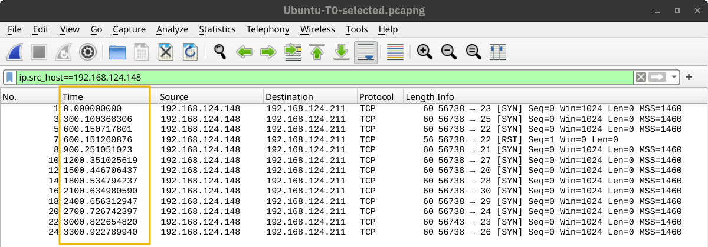
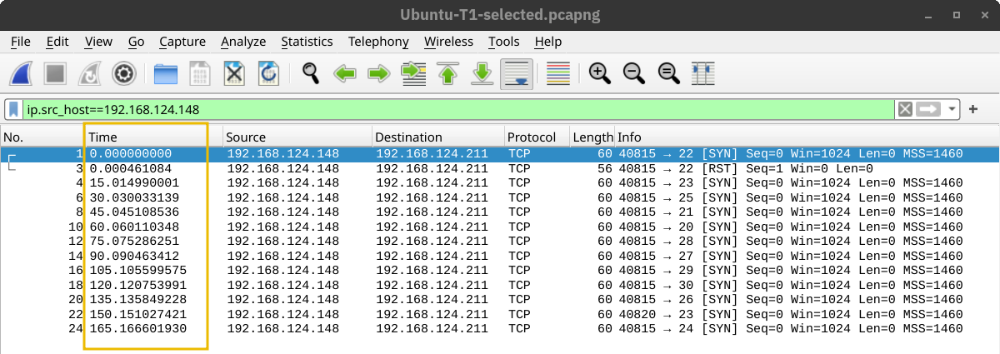
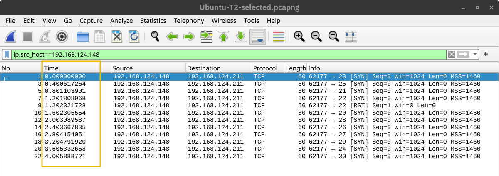
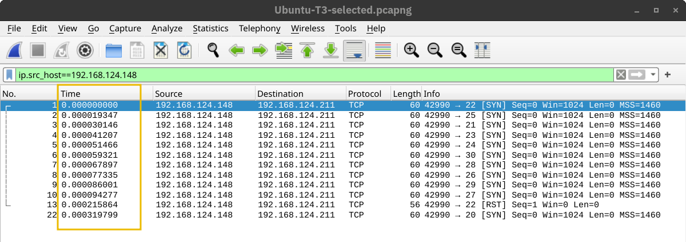

# Nmap: The Basics

**Write-up by: Nicholas Kiyimba**

## Introduction

This room covers the fundamentals of Nmap, an open-source network scanner first published in 1997. It answers two core questions for any network I'm connected to: which devices are actually online, and which network services are running on them. Doing this manually with tools like `ping`, `arp-scan`, or `telnet` is slow and unreliable — `ping` fails against a firewall blocking ICMP, and `arp-scan` only works on a directly connected network — so Nmap exists as a flexible, purpose-built tool for exactly this job.

This is foundational for cybersecurity work because host and service discovery is almost always the very first step of any security assessment, whether offensive (reconnaissance before a penetration test) or defensive (knowing what's actually running on your own network, since you can't secure what you don't know exists).

## Task 1 — Introduction

### Explanation

The room's learning objectives were: discovering live hosts, finding running services on those hosts, distinguishing port scan types, detecting service versions, controlling scan timing, and formatting output. It assumes familiarity with the TCP/IP model and its protocols, recommending the four-room Networking series (Concepts, Essentials, Core Protocols, Secure Protocols) as prerequisites, all of which I'd already completed.

## Task 2 — Host Discovery | Who is Online

### Explanation

Nmap accepts targets in a few different formats:

- **IP range** using a hyphen: `192.168.0.1-10` scans addresses `.1` through `.10`
- **IP subnet** using CIDR notation: `192.168.0.1/24` is equivalent to `192.168.0.0-255`
- **Hostname**: e.g. `example.thm`

Throughout the room, Nmap is run as root (or with `sudo`), since running as a regular local user restricts Nmap to only the most basic scan types (ICMP echo, TCP connect).

```bash
nmap -sn 192.168.66.0/24
```

**Explanation:** `-sn` is a ping scan — it discovers which hosts are alive without scanning any ports on them. This is far less "noisy" than a full port scan, useful when I just want a list of live devices without generating much traffic.

**Scanning a "local" network** (one I'm directly connected to via Ethernet/WiFi): Nmap can send ARP requests directly, and any device that replies gets marked "Host is up." Because this happens at the link layer, Nmap can also report each device's MAC address, and often the vendor associated with it (e.g. "Espressif", "Tuya Smart") — genuinely useful for guessing what kind of device is actually out there (a smart plug vs. a laptop, for instance).

**Scanning a "remote" network** (one separated from me by at least one router) works differently, since ARP doesn't function across routers. Instead, Nmap sends a *combination* of probes to determine liveness: ICMP echo requests, ICMP timestamp requests, a TCP SYN packet to port 443, and a TCP ACK packet to port 80. If a host responds to *any* of these, it's marked as up. A host that doesn't respond to any of them (including no response to the SYN/ACK probes) is marked down — and any intermediate router that can't reach the destination sends back an ICMP "destination unreachable" message, which is itself a useful signal when analysing the traffic in Wireshark.


```bash
nmap -sL 192.168.0.1/24
```

**Explanation:** `-sL` is a **list scan** — it only lists the targets that *would* be scanned, without actually sending any packets. Useful for double-checking the target range is correct before committing to a real scan.

The `-sn` ping scan tells me who's alive, but nothing about what services they're running — for that, a "noisier" type of scan is needed, covered in the next task.

### Questions

**Question:** What is the last IP address that will be scanned when your scan target is 192.168.0.1/27?

**Answer:** `192.168.0.31`

## Task 3 — Port Scanning | Who is Listening

### Explanation

Once live hosts are known, the next question is which network services (processes listening on a TCP or UDP port) are running on them — web servers on 80/443, DNS on 53, etc. Both TCP and UDP have 65,535 possible ports each.

**Connect Scan (`-sT`)** — attempts to fully complete the TCP three-way handshake against every target port. If a port is open, Nmap connects successfully and then tears the connection back down. This is essentially the same thing a Telnet client attempting a connection would do, just automated across every port.

```bash
nmap -sT 192.168.124.211
```


**SYN Scan / Stealth Scan (`-sS`)** — only performs the *first* step of the handshake: sending a SYN packet. If the port is open, the target replies with SYN-ACK, but Nmap responds with a RST instead of completing the handshake — meaning no full TCP connection is ever actually established. Since far fewer applications/logs will register a completed connection, this is considered comparatively "stealthy." A closed port behaves the same as in the connect scan (a RST-ACK straight back).

```bash
nmap -sS 192.168.124.211
```


**UDP Scan (`-sU`)** — since many important services run over UDP rather than TCP (DNS, DHCP, NTP, SNMP, VoIP), and UDP has no handshake or connection state to establish, Nmap has to probe differently. It sends UDP packets to target ports and interprets the response: an **ICMP "destination unreachable (port unreachable)"** reply generally indicates the port is closed, while no response at all is more ambiguous (could be open, or could be a filtered/dropped packet).

```bash
nmap -sU 192.168.124.211
```


**Limiting target ports:** by default, Nmap scans only the 1,000 most common ports. Other options:

- `-F` — Fast mode, scans only the 100 most common ports
- `-p[range]` — specify an exact range, e.g. `-p10-1024`, or `-p-` to scan **all** 65,535 ports (`-p1-65535`), the most thorough option
- `-p1-1023` — scans just the "well-known" ports (1–1023), where most common services live

| Option | Explanation |
|---|---|
| `-sT` | TCP connect scan — complete three-way handshake |
| `-sS` | TCP SYN — only the first step of the handshake |
| `-sU` | UDP scan |
| `-F` | Fast mode — scans the 100 most common ports |
| `-p[range]` | Specify a port range — `-p-` scans all ports |

### Questions

**Question:** How many TCP ports are open on the target system at MACHINE_IP?

**Answer:** 6

**Question:** Find the listening web server on MACHINE_IP and access it with your browser. What is the flag that appears on its main page?

**Answer:** `THM{SECRET_PAGE_38B9P6}`

## Task 4 — Version Detection | Extract More Information

### Explanation

Beyond just knowing a port is open, Nmap can make educated guesses about the operating system and exact software version behind it.

```bash
nmap -sS -O 192.168.124.211
```

**Explanation:** `-O` enables **OS detection** — Nmap examines various indicators (like how the target's TCP/IP stack behaves) to guess the OS. In the room's example, Nmap correctly identified the target as running Linux, guessing a kernel version range of 4.15–5.8, when the real version was 5.15 — close, but a reminder that OS detection is an educated guess, not a certainty.

```bash
nmap -sS -sV 192.168.124.211
```

**Explanation:** `-sV` enables **service and version detection** — Nmap probes each open port further to determine exactly what software (and version) is listening, adding a `VERSION` column to the output, e.g. identifying `OpenSSH 8.9p1 Ubuntu 3ubuntu0.10` on port 22 rather than just "ssh."

```bash
nmap -A 192.168.124.211
```

**Explanation:** `-A` is a convenience option that bundles together OS detection, version detection, traceroute, and more — a single flag instead of combining `-O` and `-sV` (and others) manually.

```bash
nmap -Pn 192.168.124.211
```

**Explanation:** By default, if a host doesn't respond during the initial host-discovery phase, Nmap marks it "down" and skips port scanning it entirely. `-Pn` overrides this, treating every specified target as online and forcing Nmap to attempt a full port scan against it regardless — useful against hosts that simply don't respond to ICMP/discovery probes but do have open ports.

| Option | Explanation |
|---|---|
| `-O` | OS detection |
| `-sV` | Service and version detection |
| `-A` | OS detection, version detection, and other additions |
| `-Pn` | Scan hosts that appear to be down |

### Questions

**Question:** What is the name and detected version of the web server running on MACHINE_IP?

**Answer:** `lighttpd 1.4.74`

## Task 5 — How Fast is FAST

### Explanation

Running a scan at full, default speed can trigger IDS or other security alerting — so Nmap provides fine-grained control over scan timing.

```bash
nmap -T<0-5> MACHINE_IP
```

**Explanation:** Nmap offers six named timing templates, selectable by number or name: **paranoid (0)**, **sneaky (1)**, **polite (2)**, **normal (3)**, **aggressive (4)**, **insane (5)**. Lower numbers wait much longer between probes (harder to detect, much slower); higher numbers fire probes with minimal delay (fast, but noisier and easier to detect).

Scanning the same 100 common ports (`-sS -F`) at different timings produced dramatically different durations in the room's lab: T0 took **9.8 hours**, T1 took **27.53 minutes**, T2 took **40.56 seconds**, and T3/T4 completed in a fraction of a second. This really drives home just how much timing controls the noise-vs-speed trade-off.









Beyond the named templates, finer control is available:

```bash
nmap --min-parallelism <numprobes> --max-parallelism <numprobes> MACHINE_IP
```

**Explanation:** Controls the minimum/maximum number of TCP/UDP probes Nmap runs simultaneously against a host group. By default Nmap adjusts this automatically — dropping toward 1 on an unreliable/lossy network, or rising to several hundred on a fast, reliable one.

```bash
nmap --min-rate <number> --max-rate <number> MACHINE_IP
```

**Explanation:** Controls the minimum/maximum rate of packets sent per second, applied across the *entire* scan rather than per individual host.

```bash
nmap --host-timeout <time> MACHINE_IP
```

**Explanation:** Sets the maximum time Nmap will spend waiting on a single slow or unresponsive host before giving up and moving on — useful to stop one bad host from stalling an entire scan.

| Option | Explanation |
|---|---|
| `-T<0-5>` | Timing template — paranoid(0), sneaky(1), polite(2), normal(3), aggressive(4), insane(5) |
| `--min-parallelism`/`--max-parallelism <numprobes>` | Min/max number of parallel probes |
| `--min-rate`/`--max-rate <number>` | Min/max packets-per-second rate |
| `--host-timeout <time>` | Max time to wait for a single target host |

### Questions

**Question:** What is the non-numeric equivalent of -T4?

**Answer:** `-T aggressive`

## Task 6 — Output | Controlling What You See

### Explanation

This task covered getting more real-time detail during a scan, and saving results afterward in a useful format.

**Verbosity:**

```bash
nmap -v 192.168.139.1/24
```

**Explanation:** `-v` enables verbose output, showing Nmap's progress stage-by-stage in real time (e.g. "Initiating ARP Ping Scan," "Initiating Parallel DNS resolution," "Initiating SYN Stealth Scan") rather than just the final summarised result. This is genuinely useful for understanding *how* Nmap is actually working through a scan, not just what it eventually finds. Verbosity can be increased further by repeating the flag (`-vv`, `-vvvv`) or specifying a level directly (`-v2`, `-v4`) — it can even be bumped up live by pressing "v" while a scan is already running.

**Debugging:**

```bash
nmap -d 192.168.139.1/24
```

**Explanation:** `-d` enables debugging-level output, which goes well beyond verbosity into genuinely detailed internal information — useful for deep troubleshooting, but produces a large volume of output. Like verbosity, the debug level can be raised (up to a maximum of `-d9`), though the room's advice was clear: be ready for thousands of lines before going that high.

**Saving scan reports:** Nmap supports several output formats simultaneously:

```bash
nmap -sS 192.168.139.1 -oA gateway
```

**Explanation:**

- `-oN <filename>` — normal, human-readable output
- `-oX <filename>` — XML output (structured, good for parsing programmatically)
- `-oG <filename>` — grep-able output (one line per host, easy to process with `grep`/`awk`)
- `-oA <basename>` — writes **all three** formats at once, using the given basename with the appropriate extension for each (`.nmap`, `.xml`, `.gnmap`)

Running `-oA gateway` produced three files: `gateway.nmap`, `gateway.xml`, and `gateway.gnmap` — meaning I only need to decide the output formats once, rather than re-running the scan multiple times for each format.

### Questions

**Question:** What option must you add to your nmap command to enable debugging?

**Answer:** `-d`

## Task 7 — Conclusion and Summary

### Explanation

This room's final summary reinforced a few key points: Nmap should generally be run with `sudo`/root privileges to unlock its full feature set — for example, Nmap automatically prefers a SYN scan (`-sS`) when running as root, but falls back to a connect scan (`-sT`) as a regular local user, since crafting a raw SYN packet directly requires elevated privileges. Running as a standard user still works, but with a meaningfully reduced set of capabilities.

The room pointed out that Nmap is a genuinely large tool, and four entire rooms in the Network Security module are dedicated to it beyond what this introductory room covered.

### Questions

**Question:** What kind of scan will Nmap use if you run `nmap MACHINE_IP` with local user privileges?

**Answer:** Connect Scan (`-sT`).

## Key Takeaways

- Learned how Nmap discovers live hosts differently depending on whether the target is on the same local network (ARP requests) or a remote/routed network (a mix of ICMP and TCP probes).
- Learned the practical difference between a TCP connect scan (`-sT`, completes the handshake) and a SYN/stealth scan (`-sS`, only sends the initial SYN), and why the latter generates less connection-level logging.
- Learned how UDP scanning (`-sU`) works differently from TCP, relying on ICMP "port unreachable" replies to infer closed ports.
- Learned how to layer on OS detection (`-O`), version detection (`-sV`), and the all-in-one `-A` flag to extract far more detail than a bare port scan provides.
- Learned how Nmap's six timing templates (`-T0`–`-T5`) trade off speed against stealth, and saw the dramatic real-world time difference this makes (9.8 hours down to a fraction of a second across the same 100-port scan).
- Learned how to control real-time scan feedback with verbosity (`-v`) and debugging (`-d`) levels, and how to save results in normal, XML, and grep-able formats simultaneously with `-oA`.
- Understood why Nmap needs root/sudo privileges for its full capability set, and what specifically changes (SYN scan vs. connect scan) when run as a regular user.

## Conclusion

This room gave me a solid, practical foundation in Nmap — not just the commands, but *why* each scan type behaves the way it does at the packet level, which the Wireshark captures throughout made concrete rather than abstract. Seeing the actual SYN/SYN-ACK/RST exchange for a stealth scan, or the literal 300-second gaps between probes at `-T0`, made the trade-offs between speed and stealth click in a way that just reading the flag descriptions wouldn't have. Given how central host and service discovery is to both offensive and defensive security work, I expect to be using these exact flags constantly going forward, and I'm looking forward to the four dedicated Nmap rooms in the Network Security module to build on this.

---
*This write-up reflects my own understanding and notes from completing this room on TryHackMe.*
