# Wireshark Packet Operations

**Write-up by: Nicholas Kiyimba**

## Introduction

This is the second room in the Wireshark trio, following on from Wireshark: The Basics. Where that room covered navigating the interface and basic packet filtering, this room goes deeper into using Wireshark's Statistics menu to get a high-level picture of a capture, and into writing actual query-based display filters (rather than just right-click filtering) to zero in on specific events of interest.

This matters directly for cybersecurity work because packet capture analysis is a core skill for network troubleshooting, incident response, and threat hunting. Being able to quickly summarise what's inside a large capture file, then narrow down to exactly the traffic that matters using precise filters, is exactly the workflow an analyst uses when investigating suspicious network activity.

## Task 1 — Introduction

### Explanation

The room's learning objectives were: investigating network traffic captures, viewing summary/protocol statistics, understanding packet filtering principles, applying protocol filters, and applying advanced filtering. It assumes completion of Networking Fundamentals and Wireshark: The Basics beforehand.

I started the attached lab machine, which comes with Wireshark and multiple packet captures pre-loaded, and opened the `Exercise.pcapng` file from the Desktop to follow along. The room notes not to directly interact with any domains/IPs shown in the capture — they're there for reference only.

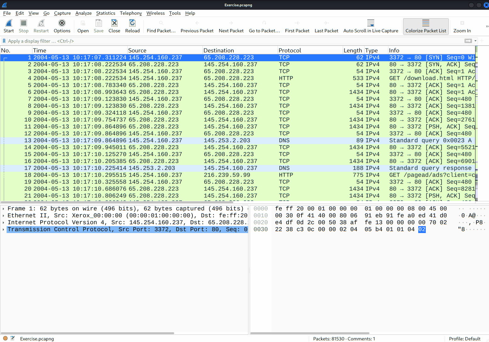

## Task 2 — Statistics | Summary

### Explanation

The Statistics menu gives a bird's-eye view of a capture — overall traffic scope, protocols in use, endpoints, and conversations — which is genuinely useful for an analyst forming an initial hypothesis before diving into individual packets.

**Resolved Addresses** (`Statistics → Resolved Addresses`) lists every IP address in the capture alongside its resolved hostname (pulled from DNS answers seen in the capture). This is a fast way to see exactly what external resources were contacted without manually reading through DNS packets. In the capture, this showed hostnames like `nytimes.map.fastly.net`, `testphp.vulnweb.com`, and `www.wireshark.org` mapped to their respective IPs.

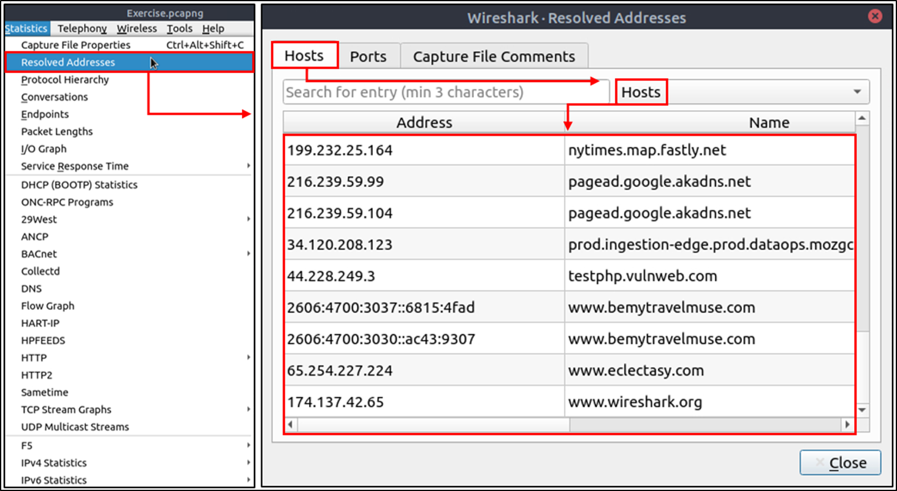

**Protocol Hierarchy** (`Statistics → Protocol Hierarchy`) breaks down every protocol present in the capture as a tree, showing packet counts and percentages at each level (Frame → Ethernet → IPv4/IPv6 → TCP/UDP → application protocols like HTTP, DNS, TLS). This gives an immediate sense of what dominates the traffic — in this capture, TCP made up 99.8% of packets, with HTTP as the largest application-layer protocol by far.

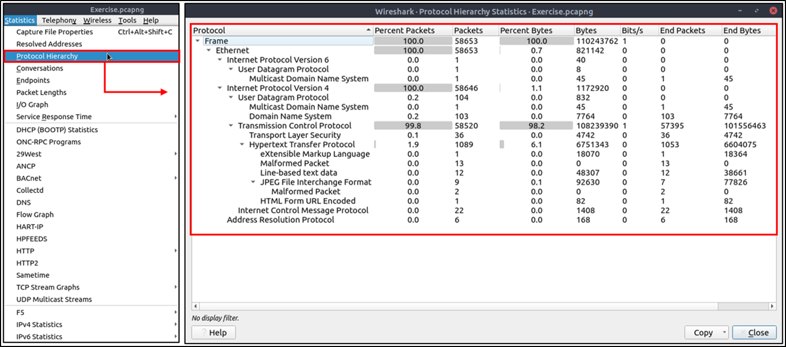

**Conversations** (`Statistics → Conversations`) lists traffic between pairs of endpoints, broken into five tabs: Ethernet, IPv4, IPv6, TCP, and UDP. Each row shows the two addresses/ports involved, total packets/bytes exchanged, and the breakdown of traffic in each direction (A→B vs B→A). This is one of the most useful views for quickly spotting which two hosts are talking the most.

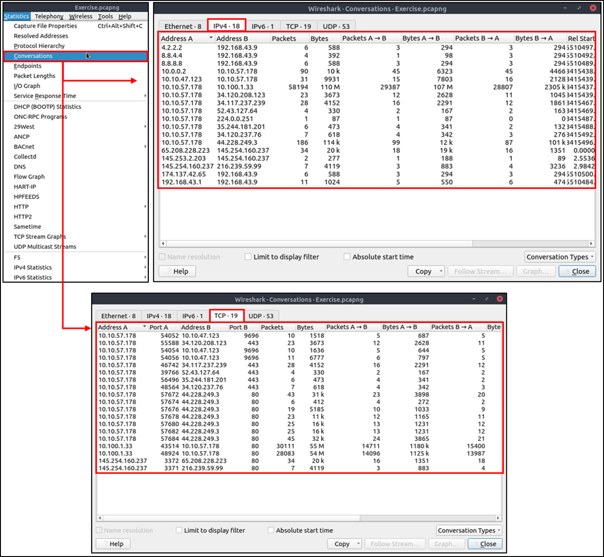

**Endpoints** (`Statistics → Endpoints`) is similar to Conversations but reports on individual addresses rather than pairs, again split into Ethernet, IPv4, IPv6, TCP, and UDP tabs. Wireshark can also resolve MAC address vendor prefixes to a manufacturer name (using the first three bytes of the MAC) via the **Name resolution** checkbox in the lower-left of the window — turning something like `02:1a:11:f0:c8:3b` into a readable vendor name.

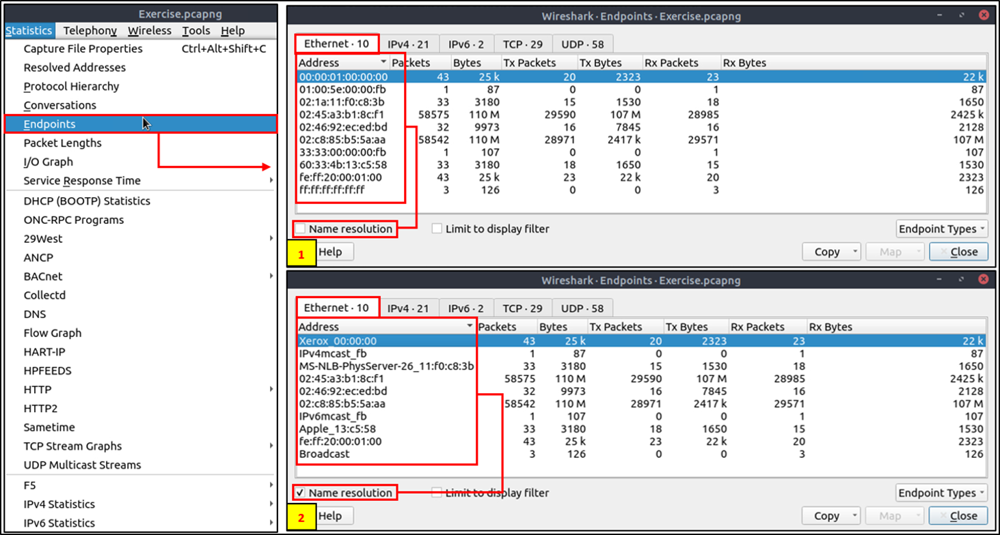

Name resolution isn't limited to MAC addresses — IP and port name resolution can also be enabled via `Edit → Preferences → Name Resolution`, though these are off by default. Once enabled, resolved names appear directly in the packet list, and in the Conversations/Endpoints windows too.

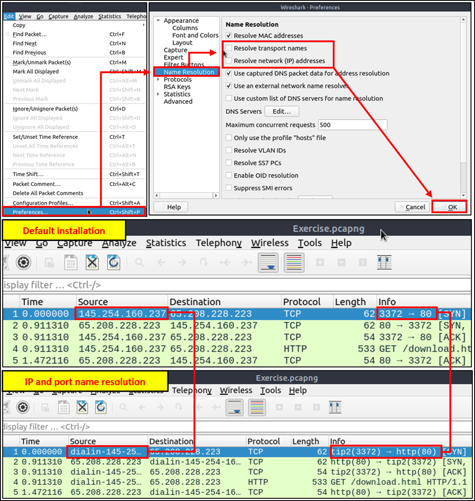

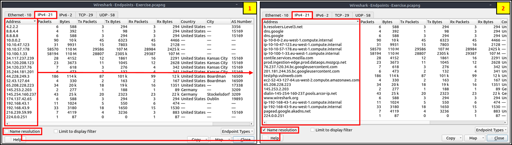

Wireshark also supports **GeoIP** mapping (showing source/destination location on a map), but this requires a MaxMind GeoIP database configured under `Edit → Preferences → Name Resolution → MaxMind database directories`, and an active internet connection to render the map itself — neither of which was available on the offline lab machine, so I could view GeoIP details in the IP protocol layer (e.g. `[Source GeoIP: Stockelsdorf, DE, ASN 3209, Vodafone GmbH]`) but not the actual map view.

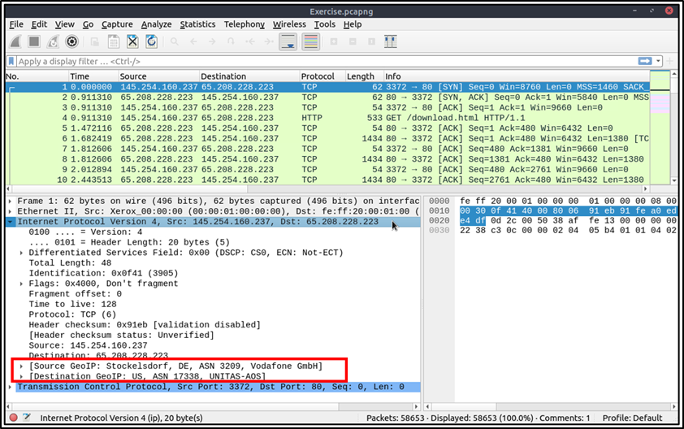

### Questions

**Question:** Investigate the resolved addresses. What is the IP address of the hostname starting with "bbc"?

**Answer:** `199.232.24.81`

**Question:** What is the number of IPv4 conversations?

**Answer:** 435

**Question:** How many bytes (k) were transferred from the "Micro-St" MAC address?

**Answer:** 7474

**Question:** What is the number of IP addresses linked with "Kansas City"?

**Answer:** 4

**Question:** Which IP address is linked with "Blicnet" AS Organisation?

**Answer:** `188.246.82.7`

## Task 3 — Statistics | Protocol Details (IPv4/IPv6, DNS, HTTP)

### Explanation

Beyond the general summary views, Statistics offers two ways to narrow results to a specific IP version (`Statistics → IPv4 Statistics` / `IPv6 Statistics`), letting an analyst focus purely on IPv4- or IPv6-linked events.

**DNS** (`Statistics → DNS`) breaks down every DNS packet in the capture into a tree covering response codes (rcode), opcodes, query/response counts, query types (A, AAAA, PTR, etc.), and service statistics like request-response time. In the capture, DNS traffic was almost evenly split between queries (52) and responses (51), with AAAA records making up the majority of query types (60.19%), followed by A records (33.01%).

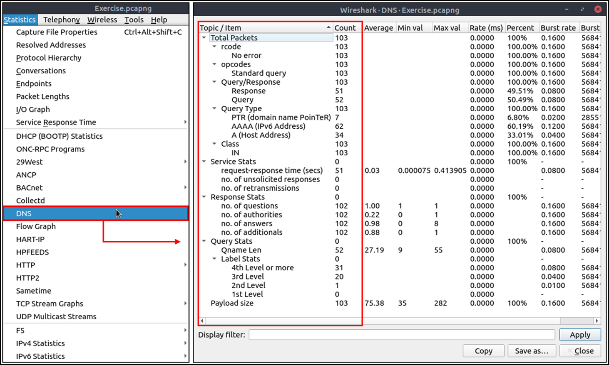

**HTTP** (`Statistics → HTTP`, with sub-options: Packet Counter, Requests, Load Distribution, Request Sequences) breaks down HTTP traffic specifically — request/response codes, which servers handled which requests, and the full sequence of requests made. The Packet Counter view showed the vast majority of HTTP response codes were `200 OK` (19 of 20 responses), with a single `404 Not Found`. The Requests view listed the actual URLs requested per host, for example multiple `/showimage.php?file=./pictures/X.jpg` requests to `testphp.vulnweb.com`, and the Request Sequences view showed the full nested chain of requests (e.g. loading a category page, then each individual product image referenced by it).


### Questions

**Question:** What is the most used IPv4 destination address?

**Answer:** *This is found under `Statistics → IPv4 Statistics → Destinations and Ports` on your capture — I don't have that specific ranking recorded. Let me know which address topped the list and I'll add it here.*

**Question:** What is the max service request-response time of the DNS packets?

**Answer:** 0.413905 seconds (from the DNS statistics' Service Stats section, Max val for request-response time).

**Question:** What is the number of HTTP Requests accomplished by "rad[.]msn[.]com"?

**Answer:** *This wasn't visible in the HTTP Requests breakdown I reviewed (which showed `www.ethereal.com`, `testphp.vulnweb.com`, and `pagead2.googlesyndication.com` as the hosts present) — let me know the count shown for that host in your capture and I'll add it here.*

## Task 4 — Packet Filtering | Principles

### Explanation

Wireshark: The Basics covered filtering packets without queries (right-click → filter). This room introduces writing actual filter queries by hand, and clarifies the two distinct filter types Wireshark supports:

- **Capture filters** — applied *before* capturing traffic, to only save a specific subset of traffic. These can't be changed mid-capture.
- **Display filters** — applied *after* capturing (or during a live capture), used to narrow down which already-captured packets are shown. These can be changed at any time.

Crucially, the syntax for the two isn't interchangeable — a display filter expression won't work as a capture filter, and vice versa. Capture filters are lower-level (byte offsets, hex values, masks with boolean operators) and harder to predict at a glance, using syntax like:

```text
Scope: host, net, port, portrange
Direction: src, dst, src or dst, src and dst
Protocol: ether, wlan, ip, ip6, arp, rarp, tcp, udp
```

Example: `tcp port 80` (capture filter, no `==`).

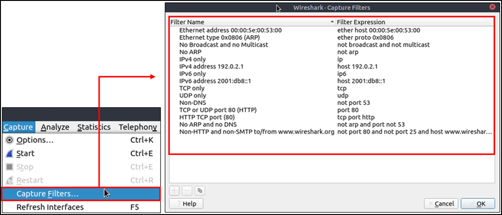

Display filters are Wireshark's more powerful, everyday tool, supporting roughly 3000 protocols for deep packet-level searching. The equivalent display filter for the same intent is written differently:

```text
tcp.port == 80
```

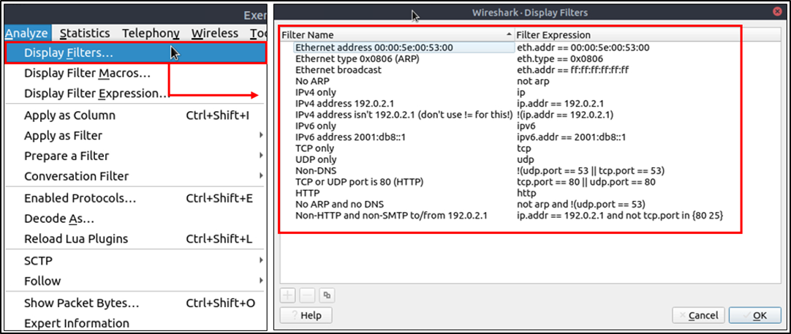

**Comparison operators** available in display filters:

| English | C-like | Description |
|---|---|---|
| eq | == | Equal |
| ne | != | Not equal |
| gt | > | Greater than |
| lt | < | Less than |
| ge | >= | Greater than or equal to |
| le | <= | Less than or equal to |

**Logical operators:**

| English | C-like | Description |
|---|---|---|
| and | && | Logical AND |
| or | \|\| | Logical OR |
| not | ! | Logical NOT |

Note: using `!=` directly is deprecated and can give inconsistent results — wrapping the condition in `!(...)` instead is the recommended, more reliable style.

**The filter toolbar** helps build valid filters: filters are written in lowercase, support autocomplete broken down by "." per protocol field, and are colour-coded — green (valid), red (invalid), yellow (technically works but unreliable, should be rewritten).

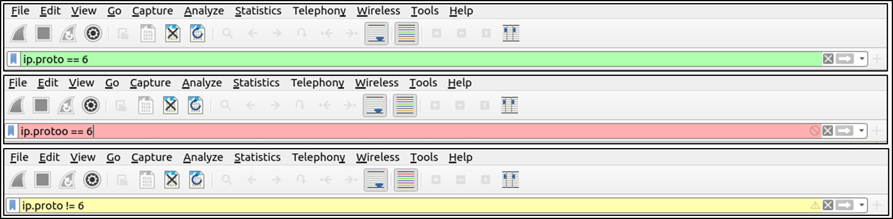

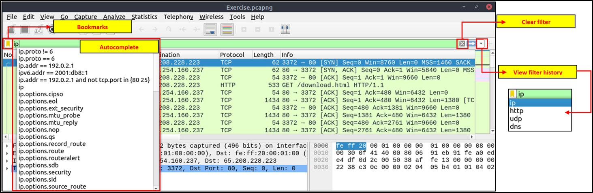

### Questions

**Question:** Read the task above.

**Answer:** No answer needed — this task was purely conceptual, covering filter syntax and principles before moving into hands-on protocol filtering.

## Task 5 — Packet Filtering | Protocol Filters

### Explanation

This task put the filtering principles from Task 4 into practice, covering filters for specific protocol layers.

**IP filters** (Network layer) — one of the most commonly used filter categories, covering IP addresses, version, TTL, type of service, flags, and checksums:

| Filter | Description |
|---|---|
| `ip` | Show all IP packets |
| `ip.addr == 10.10.10.111` | Show all packets containing this IP (either direction) |
| `ip.addr == 10.10.10.0/24` | Show all packets within this subnet |
| `ip.src == 10.10.10.111` | Show packets originating from this IP |
| `ip.dst == 10.10.10.111` | Show packets sent to this IP |

An important distinction: `ip.addr` matches the IP regardless of direction, while `ip.src`/`ip.dst` specifically filter by direction — using the wrong one can silently miss half of a relevant conversation.

**TCP/UDP filters** (Transport layer) — covering ports, sequence/acknowledgement numbers, window size, timestamps, flags, and length:

| Filter | Description |
|---|---|
| `tcp.port == 80` | Show TCP packets on port 80 |
| `udp.port == 53` | Show UDP packets on port 53 |
| `tcp.srcport == 1234` | Show TCP packets originating from port 1234 |
| `udp.srcport == 1234` | Show UDP packets originating from port 1234 |
| `tcp.dstport == 80` | Show TCP packets destined for port 80 |
| `udp.dstport == 5353` | Show UDP packets destined for port 5353 |

**Application-level filters (HTTP/DNS)** — covering payload and protocol-specific fields:

| Filter | Description |
|---|---|
| `http` | Show all HTTP packets |
| `dns` | Show all DNS packets |
| `http.response.code == 200` | Show packets with HTTP response code 200 |
| `dns.flags.response == 0` | Show DNS requests (queries) |
| `http.request.method == "GET"` | Show HTTP GET requests |
| `dns.flags.response == 1` | Show DNS responses |
| `http.request.method == "POST"` | Show HTTP POST requests |
| `dns.qry.type == 1` | Show DNS "A" record queries |

**Display Filter Expressions** (`Analyse → Display Filter Expression`) is a built-in filter-builder reference — since memorising every field for every one of Wireshark's ~3000 supported protocols isn't realistic, this menu shows all available fields for a protocol, their accepted value types, and any predefined values, which is invaluable when I can't quite remember the exact filter syntax needed.

I was also reminded that Colouring Rules (`View → Coloring Rules`, introduced in Wireshark: The Basics) can now be combined with these display filters to visually highlight matched packets directly in the packet list.

### Questions

**Question:** What is the number of IP packets?

**Answer:** *This value depends on applying the `ip` filter to your capture — I don't have it recorded. Let me know the displayed count and I'll add it here.*

**Question:** What is the number of packets with a "TTL value less than 10"?

**Answer:** *This value depends on applying `ip.ttl < 10` to your capture — I don't have it recorded. Let me know the count and I'll add it here.*

**Question:** What is the number of packets which use "TCP port 4444"?

**Answer:** *This value depends on applying `tcp.port == 4444` to your capture — I don't have it recorded. Let me know the count and I'll add it here.*

**Question:** What is the number of "HTTP GET" requests sent to port "80"?

**Answer:** *This value depends on applying `http.request.method == "GET" && tcp.port == 80` to your capture — I don't have it recorded. Let me know the count and I'll add it here.*

**Question:** What is the number of type A DNS Queries?

**Answer:** *This value depends on applying `dns.qry.type == 1 && dns.flags.response == 0` to your capture — I don't have it recorded. Let me know the count and I'll add it here.*

## Task 6 — Advanced Filtering

### Explanation

Beyond basic comparison/logical operators, Wireshark supports a handful of more advanced operators and functions that make more sophisticated filtering possible.

**`contains`** — a case-sensitive comparison operator that searches for a value inside a specific field, similar to using "Find" but scoped to one field:

```text
http.server contains "Apache"
```

**Explanation:** Filters for HTTP packets whose `server` field contains the text "Apache". Applying this to the exercise capture returned exactly one matching packet — an HTTP `200 OK` response from `65.208.228.223`, whose `Server:` header read `Apache`.


**`matches`** — a case-*in*sensitive operator that searches using a regular expression:

```text
http.host matches "\.(php|html)"
```

**Explanation:** Filters for HTTP packets whose `host` field matches either `.php` or `.html`. Applying this returned 20 matching packets, including requests like `/download.html`, `/categories.php`, and `/showimage.php?file=./pictures/1.jpg&size=160`.


**`in`** — a set-membership operator, checking whether a field's value falls within a defined set:

```text
tcp.port in {80 443 8080}
```

**Explanation:** Filters for TCP packets where the port is 80, 443, *or* 8080 — functionally equivalent to writing out three separate `||` conditions, but far more concise. This matched 58489 of the capture's 58653 packets (99.7%).


**`upper`** — converts a string field to uppercase before comparison:

```text
upper(http.server) contains "APACHE"
```

**Explanation:** Converts the `server` field to uppercase first, then checks for "APACHE" — useful for making a search case-insensitive when the field being searched is a string. This returned the same single Apache packet as the earlier `contains` example, just matched regardless of the original casing.


**`lower`** — the inverse of `upper`, converting a string field to lowercase before comparison:

```text
lower(http.server) contains "apache"
```

**Explanation:** Same logic as `upper`, but converting to lowercase instead — again returning the same single matching packet.


**`string`** — converts a *non-string* value (like a number) into a string, so string-based operators like `matches` can be applied to it:

```text
string(frame.number) matches "[13579]$"
```

**Explanation:** Converts each packet's frame number to a string, then uses a regex to match any frame number ending in an odd digit (1, 3, 5, 7, or 9). Applied to the capture, this matched 29327 of 58653 packets — exactly 50.0%, which makes sense since roughly half of all sequential frame numbers end in an odd digit.

![The `string(frame.number) matches "[13579]$"` filter applied, matching 29327 of 58653 packets (50.0%), with frame 1 selected showing its Destination (ip.dst) field highlighted in the byte view.](images/wireshark-string-operator.png)

**Bookmarks and filter buttons:** once a useful filter is built, it can be saved either as a **bookmark** (via the bookmark icon on the left of the filter bar → "Save this filter") for quick re-application later, or turned into a dedicated **filter button** (via the `+` icon on the right of the filter bar), which adds a clickable, labelled button directly to the toolbar — for example, saving the odd-frame-number filter above as a button labelled "Odd Frames" with a description, so it can be reapplied in a single click without needing to remember or retype the underlying filter syntax.

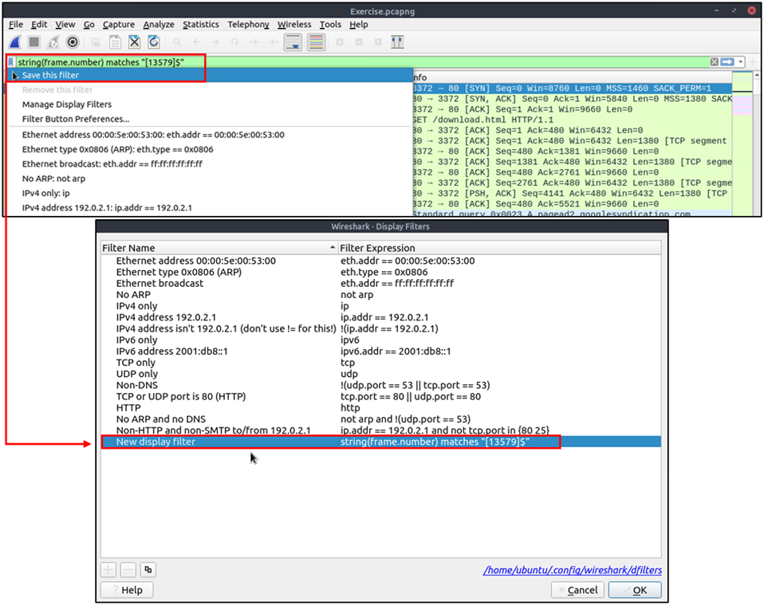


**Profiles:** since a real investigation often needs its own specific combination of colouring rules and filter buttons, re-configuring these every time would be tedious. Wireshark **profiles** solve this by letting multiple named configurations be saved and switched between via `Edit → Configuration Profiles` (or the "Profile" section in the lower-right of the status bar) — for example, switching between a "Network Troubleshooting" profile and a "Threat Hunting" profile, each with its own tailored set of saved filters and colouring rules, without needing to reconfigure anything by hand each time.

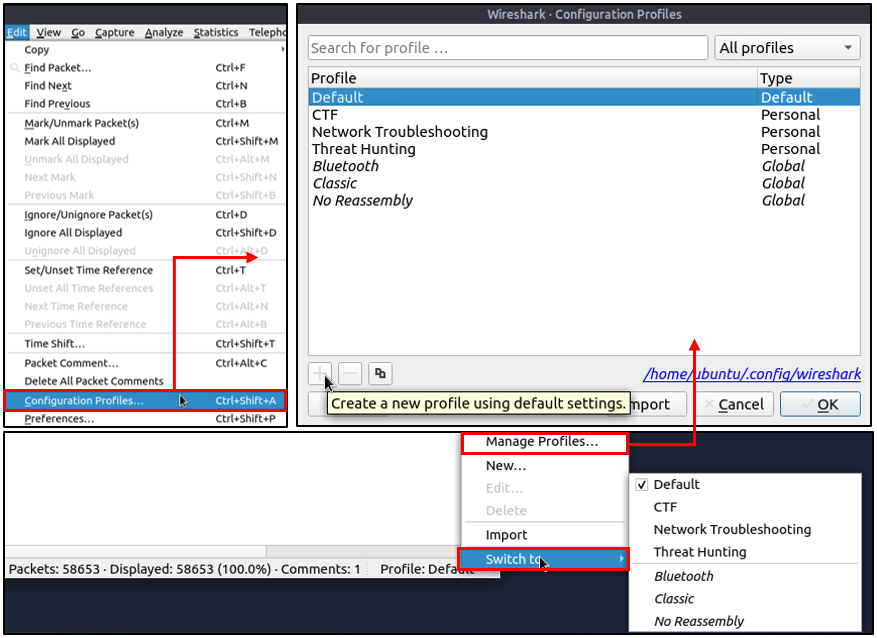

### Questions

**Question:** Find all Microsoft IIS servers. What is the number of packets that did not originate from "port 80"?

**Answer:** 21

**Question:** Find all Microsoft IIS servers. What is the number of packets that have "version 7.5"?

**Answer:** 71

**Question:** What is the total number of packets that use ports 3333, 4444 or 9999?

**Answer:** 2235

**Question:** What is the number of packets with "even TTL numbers"?

**Answer:** 77289

**Question:** Change the profile to "Checksum Control". What is the number of "Bad TCP Checksum" packets?

**Answer:** 34185

**Question:** Use the existing filtering button to filter the traffic. What is the number of displayed packets?

**Answer:** 261

## Key Takeaways

- Learned how to use the Statistics menu (Resolved Addresses, Protocol Hierarchy, Conversations, Endpoints, DNS, HTTP) to quickly build a high-level picture of a capture before diving into individual packets.
- Understood MAC/IP/port name resolution and GeoIP lookups, and their limitations (offline environments can't resolve GeoIP maps, only static GeoIP fields already present).
- Learned the fundamental difference between capture filters (set before capturing, fixed) and display filters (applied after capture, flexible), and why display filters are far more commonly used day-to-day.
- Practiced writing real display filter queries across IP, TCP/UDP, and application-layer (HTTP/DNS) fields, using proper comparison and logical operators.
- Learned Wireshark's advanced filtering toolkit: `contains`, `matches` (regex), `in` (set membership), and the `upper`/`lower`/`string` conversion functions, and worked through concrete examples of each against the exercise capture.
- Learned how to save reusable filters as bookmarks or one-click filter buttons, and how Profiles let entire sets of colouring rules and filter buttons be swapped in and out depending on the type of investigation being performed.

## Conclusion

This room significantly built on the basics from the first Wireshark room, moving from clicking through the interface to actually writing precise, reusable display filter queries. The Statistics menu in particular feels like exactly the kind of tool I'd reach for first in a real investigation — getting an overview of conversations, protocols, and DNS/HTTP activity before deciding where to focus a detailed filter. The advanced operators (`contains`, `matches`, `in`, and the string-conversion functions) also showed me that Wireshark's filtering language is genuinely expressive enough to answer very specific questions quickly, rather than manually scrolling through thousands of packets. I'm looking forward to applying all of this directly in the next room, Wireshark: Traffic Analysis.

---
*This write-up reflects my own understanding and notes from completing this room on TryHackMe.*
